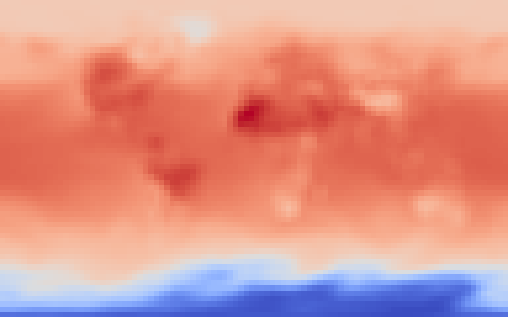

# granite-wxc

This repository contains code and examples to apply the [Prithvi WxC foundation model](https://github.com/NASA-IMPACT/Prithvi-WxC) to downscaling tasks. In particular, the repository contains both code and instructions for generic fine-tuning tasks as well as fine-tuned models for MERRA2 2m temperature data as reference.

<p align="center">

</p>

## Getting started

1. Create a virtual environment
2. Clone this repository as well as that of the foundation model. Install both in the virtual environment.:
   ```
   git clone https://github.com/NASA-IMPACT/Prithvi-WxC
   git clone https://github.com/IBM/granite-wxc.git
   cd Prithvi-WxC
   pip install '.[examples]'
   cd ../granite-wxc
   pip install '.[examples]'
   ```
3. Run the [notebook in the examples directory](examples/granitewxc_downscaling/notebooks/granitewxc_downscaling_inference.ipynb).

   This notebook will download model weights as well as sample data for basic illustration from [Hugging Face](https://huggingface.co/ibm-granite/granite-geospatial-wxc-downscaling).

## Fine-tuned model

The fine-tuned model for MERRA-2 2m temperature data is available via [Hugging Face](https://huggingface.co/ibm-granite/granite-geospatial-wxc-downscaling). For an application to EURO-CORDEX data please refer to the paper.
